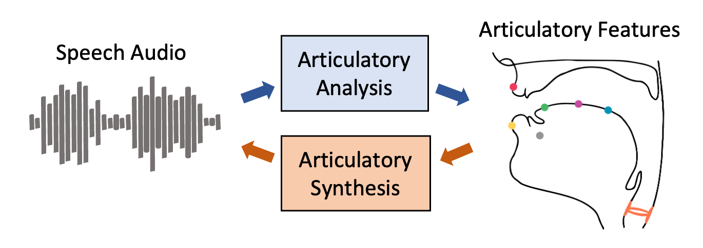

# Speech Articulatory Coding (SPARC)
[Paper](https://arxiv.org/abs/2406.12998) | [Audio Samples](https://berkeley-speech-group.github.io/sparc-demo) | [Colab Demo](https://colab.research.google.com/drive/1TVGJJpOzPiesLPo46gZNCQLMl-y_QIKe#scrollTo=uBemLVlk-s7W)

<div align="center">
    
</div>

This is the official code base for [Coding Speech through Vocal Tract Kinematics](https://arxiv.org/abs/2406.12998).

## Installation

```
pip install speech-articulatory-coding
```

## Usage

#### Load Model

```python
from sparc import load_model
coder = load_model("en", device= "cpu")     # For using CPU
coder = load_model("en", device= "cuda:0")  # For using GPU
```

For pitch tracker, we found [PENN](https://github.com/interactiveaudiolab/penn) is fast at inference. You can activate that with `use_penn=True`. The default is using [torchcrepe](https://github.com/maxrmorrison/torchcrepe).

```python
coder = load_model("en", device= "cpu", use_penn=True)    # Use PENN for pitch tracker

```

For inversion only, you can use the following,

```python
coder = load_model("feature_extraction") 
coder_from_config = load_model(config="configs/feature_extraction.yaml")
```

The following model checkpoints are offered. You can replace `en` with other models (`multi` or `en+`) in `load_model`.

| Model  | Language |     Training Dataset    | 
|--------|:--------:|:--------------:|
| en     |  English |LibriTTS-R|
| multi  |   Multi  |LibriTTS-R, Multilignual LibriSpeech, AISHELL, JVS, KSS    |
| en+     |  English |LibriTTS-R, LibriTTS, EXPRESSO|


#### Articulatory Analysis

```python
code = coder.encode(WAV_FILE)          # Single inference
codes = coder.encode([WAV_FILE1, WAV_FILE2, ...]) # Batched processing
```


The articulatory code outputs have the following format.

```python
# All features are in 50 Hz except speaker encoding
{"ema": (L, 12) array, #'TDX','TDY','TBX','TBY','TTX','TTY','LIX','LIY','ULX','ULY','LLX','LLY'
 "loudness": (L, 1) array, 
 "pitch": (L, 1) array, 
 "periodicity": (L, 1) array, # auxiliary output of pitch tracker
 "pitch_stats": (pitch mean, pitch std),
 "spk_emb": (spk_emb_dim,) array, # all shared models use spk_emb_dim=64
 "ft_len": Length of features, # usefull when batched processing with padding
}
```

#### Articulatory Synthesis

```python
wav = coder.decode(**code)
sr = coder.sr
```

#### Voice Conversion

```python
wav = coder.convert(SOURCE_WAV_FILE, TARGET_WAV_FILE)
sr = coder.sr
```
#### Demo

Please check `notebooks/demo.ipynb` for a demonstration of the functions.


### Training

#### Feature extraction

Check `scripts/encode_audio.py` and an example script for extracting LibriTTS, `scripts/extract_libritts.sh`


## TODO

- Add training codes.

